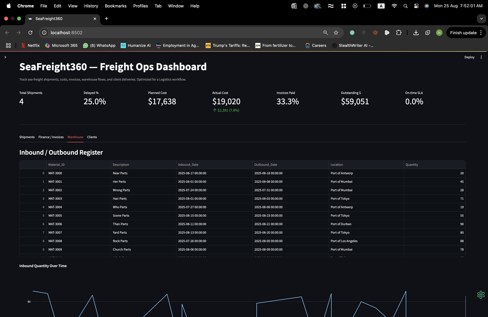

# SeaFreight360 – Logistics Dashboard

SeaFreight360 is a data driven logistics dashboard built with **Streamlit**, **Pandas**, and **Plotly**.  
It brings together shipments, invoices, warehouse flows, and client deliveries into one clear view.  

---

## ive Demo

[](https://YOUR-APP-URL.streamlit.app)  

Try it here: **https://seafreight360-4sqnzhugt66zvsxgpbupnj.streamlit.app/**

---

## Features

### Shipment Tracking
- Filters by origin, destination, status, and ETA window  
- SLA calculation for on time delivery  
- Planned vs Actual cost with variance by route  
- Alerts for cost overruns and ETA at risk shipments  

### Finance and Invoices
- Payment status breakdown  
- Outstanding and overdue invoices  
- KPI strip with Paid % and Outstanding value  
- Export to CSV for quick follow up  

### Warehouse
- Inbound trend over time  
- Current inventory on hand  
- Quantity by location  

### Clients
- Delivery status mix  
- Upcoming pickups (≤ 7 days)  
- Export client data for quick update  

---

## Tech Stack

- Python 3.10+  
- Streamlit  
- Pandas  
- Plotly  

---

## Project Structure

SeaFreight360/
├── app.py
├── requirements.txt
├── README.md
├── .gitignore
└── data/
├── shipments.csv
├── invoices.csv
├── warehouse.csv
└── clients.csv

---

---

## Screenshots

### Shipments Tab  


### Finances / Invoices Tab  


### Warehouse Tab  


### Clients Tab

## ⚡ Quickstart

1. Clone repo  
```bash
git clone https://github.com/habs000/SeaFreight360.git
cd SeaFreight360


